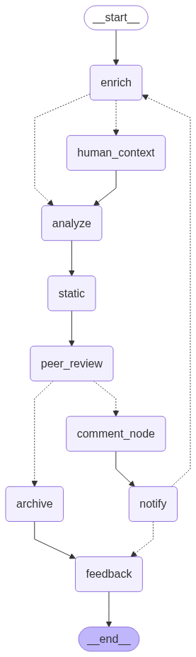

# 🤖 Automated Peer Code Review Workflow

End-to-end automated code review using **LangGraph**, open-source LLMs, and **LangSmith** for full debugging and traceability.

---

## 📋 Overview

This project automates the peer code review process for engineering teams.  
It uses a modular LangGraph workflow to:
- **Orchestrate** code snippets and documentation
- **Analyze and review** code using an LLM in an *abstractive* manner
- Include a **human review step** for additional context or approval
- **Archive review results** for record-keeping
- **Trace every step** with LangSmith for debugging and transparency

---
## 🛠️ Workflow Stages

**Nodes (Steps):**
1. **Enrich Context (LLM):**  
   LLM summarizes code and README, describing purpose, inputs/outputs, constraints, and possible tests.
2. **Human Context Correction (Optional):**  
   If the context summary is short or unclear, a human reviewer can correct/add details.
3. **Analyze Code (LLM):**  
   LLM reviews code using context, pointing out bugs, style issues, and suggesting improvements.
4. **Static Analysis (Optional):**  
   Runs static checks (demo: placeholder report).
5. **Peer Review (Human):**  
   Human reviewer sees LLM/static outputs, approves or requests further action.
6. **Comment & Action (LLM+Human):**  
   LLM generates actionable comments; human can edit/add final notes.
7. **Notify Submitter:**  
   Simulates notifying the code author for fixes/resubmission.
8. **Archive Review:**  
   Saves the full review history to disk (or database).
9. **Feedback/Retrospective:**  
   Collects feedback from the submitter for process improvement.

---

## 🔄 Conditional Edges

- After **enrich**:  
  - If LLM summary is too short, send to `human_context`, else proceed to `analyze`.
- After **peer_review**:  
  - If approved, archive the review.  
  - If not, generate actionable comments and notify submitter for fixes.
- After **notify**:  
  - If under 2 review rounds, return to `enrich` for another cycle.  
  - Otherwise, finish with `feedback`.

---

### **Example:**


**Output Review:**  
const reviewReport = `
# 📝 Peer Code Review Report

## 🧩 Code Submitted

```python
def factorial(n):
    """Compute the factorial of a number."""
    if n == 0:
        return 1
    else:
        return n * factorial(n-1)
```

---

## 📄 Documentation Provided

> This module contains a recursive function to compute the factorial of a non-negative integer.  
> Handles base case and recursion. Used in math utilities.

---

## 🧠 **AI Context Summary**

**Purpose:**  
Defines a recursive function named `factorial` to compute the factorial of a given non-negative integer input.

**Inputs:**  
Accepts a single input `n`, which must be a non-negative integer.

**Outputs:**  
Returns an integer—the factorial of the input number.

**Constraints:**  
Defined only for non-negative integers. Recursive implementation assumes valid input.

**Suggested Tests (unittest):**
- `self.assertEqual(factorial(0), 1)` *(base case)*
- `self.assertEqual(factorial(1), 1)`
- `self.assertEqual(factorial(2), 2)`
- `self.assertEqual(factorial(3), 6)`

---

## 🤖 **LLM Review**

**Bugs:**  
- Code is correct, but input validation should be added to accept only non-negative integers.

**Style Issues:**  
- The docstring is separated from the function definition by a blank line. It is best practice to keep them together for readability.

**Improvements:**  
1. Add input validation for non-negative integers.
2. Move the docstring directly under the function definition.
3. Consider an iterative approach for performance on small inputs.
4. Optionally, rename the function to something more descriptive, e.g. \`compute_factorial\`.

---

## 🛡️ **Static Analysis**

> Static analysis: No major issues found (demo).

---

## 👤 **Peer Review Comment**

> ok

---

## ✅ **Approval Status**

**Approved** by reviewer: Bob  
**Submitter:** Alice

---

## 🗃️ **Feedback / Retrospective**

> _no feedback_

---

## 📚 **Review Summary**

- Code reviewed and approved.
- Suggestions for improvement have been noted.
- No additional feedback from submitter.

---


---


## 🖇️ Architecture



---

## 💡 Customization

- Swap in any open-source code LLM (e.g., [StarCoder-3B](https://huggingface.co/bigcode/starcoderbase-3b), [CodeLlama-7B](https://huggingface.co/codellama/CodeLlama-7b-Instruct-hf))
- Integrate with your internal developer tools or Slack for notifications
- Extend with custom linting, static analysis, or test suggestions

---


## 🤝 Contributions

Pull requests and feature suggestions are welcome!

---


